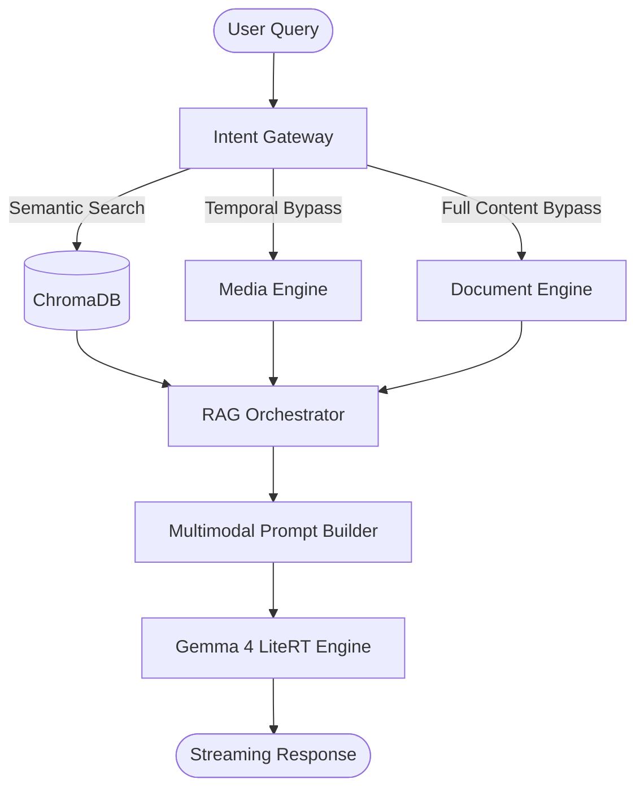

# GemmaDesk: Offline Multimodal Study Assistant

GemmaDesk is a local-first, privacy-focused Retrieval-Augmented Generation (RAG) system designed to transform personal documents and media into an interactive, AI-powered knowledge base. By utilizing Google's **Gemma 4 (LiteRT)** and specialized local processing engines, it allows users to chat with their files—including PDFs, Text, Audio, Video, and Images—without ever sending data to the cloud.

## The Vision: Democratizing AI for Everyone

AI is often an exclusive tool, requiring high-speed internet, expensive subscriptions, and massive hardware. This creates a digital divide, leaving students in remote areas or with limited resources behind. 

**GemmaDesk destroys that barrier.** Our mission is to provide high-end AI capabilities to anyone, anywhere, regardless of their internet connectivity. By running state-of-the-art models directly on standard consumer hardware, we ensure that a world-class personal tutor is always available—100% offline, 100% private, and 100% accessible. 

## Core Capabilities

- **Personalized Polyglot Tutor:** GemmaDesk breaks down language barriers. It can read dense academic jargon in one language and instantly explain it in simple terms in another, supporting over 140 languages.
- **Visual Intelligence:** It doesn't just read text—it natively *sees* diagrams, charts, and math formulas inside textbooks, providing clear, grounded explanations.
- **Temporal Video Search:** Large video lectures are no longer a black box. Users can ask about specific moments (e.g., *"What was on the blackboard at 14:30?"*) and GemmaDesk will instantly find the exact timestamp.
- **Total Data Sovereignty:** Your study materials, private notes, and recorded lectures never leave your machine.

## High-Level Design (HLD)

GemmaDesk follows a modular "Unified Engine" architecture, designed to run as a single process for maximum efficiency.



- **Intent Gateway:** Routes queries based on user intent (e.g., bypassing search for explicit summary requests or timestamp queries).
- **RAG Orchestrator:** The central brain coordinating context retrieval across Vision, Media, and Document engines.
- **LiteRT Engine:** An optimized local inference layer for the 4-bit quantized Gemma model.

## Getting Started

### 1. Clone the Repository
Open your terminal and run:
```bash
git clone https://github.com/anuragba01/gemmadesk.git
cd gemmadesk
```

### 2. Installation
Ensure you have Python 3.10+ installed. We recommend using `uv` for lightning-fast dependency management:
```bash
uv pip install -r requirements.txt
```

### 3. Launch & Automated Setup
GemmaDesk is designed to be self-bootstrapping. You only need to run the main application:

```bash
uv run streamlit run app/app.py
```

- **First-Time Use:** If the AI models (~3.2GB) are missing, the app will automatically launch the **Setup Manager** UI to guide you through the download.
- **Regular Use:** Once the models are downloaded, the same command will boot directly into the chat interface.

  ,

## Live Demo
You can view the project details and access downloads on our landing page:
[**GemmaDesk Official Website**](https://anuragba01.github.io/gemmadesk/)

## Detailed Documentation
- [**Developer Setup Guide**](doc/guide.md): Installation and configuration.
- [**Detailed System Design**](doc/detailed_system_design.md): LLD, data pipelines, and trade-offs.
- [**File Structure Guide**](doc/file.md): Map of the repository's modules.
