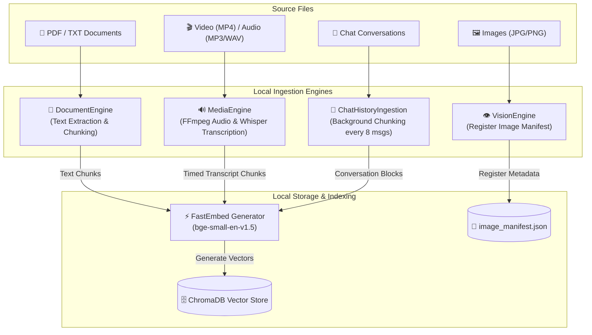

# GemmaDesk: Offline Multimodal Study Assistant

GemmaDesk is a local-first, privacy-focused Retrieval-Augmented Generation (RAG) system designed to transform personal documents and media into an interactive, AI-powered knowledge base. By utilizing Google's **Gemma 4 (LiteRT)** and specialized local processing engines, it allows users to chat with their files—including PDFs, Text, Audio, Video, and Images—without ever sending data to the cloud.

> 🏆 **Google Gemma Hackathon Project**
> GemmaDesk was proudly developed for the **[Google Gemma 4 Good Hackathon](https://www.kaggle.com/competitions/gemma-4-good-hackathon)** to showcase the power of lightweight, high-performance on-device intelligence in bridging the digital divide for educational equity and data sovereignty.


## The Vision: Democratizing AI for Everyone

AI is often an exclusive tool, requiring high-speed internet, expensive subscriptions, and massive hardware. This creates a digital divide, leaving students in remote areas or with limited resources behind. 

**GemmaDesk destroys that barrier.** Our mission is to provide high-end AI capabilities to anyone, anywhere, regardless of their internet connectivity. By running state-of-the-art models directly on standard consumer hardware, we ensure that a world-class personal tutor is always available—100% offline, 100% private, and 100% accessible. 

## Core Capabilities

- **Personalized Polyglot Tutor:** GemmaDesk breaks down language barriers. It can read dense academic jargon in one language and instantly explain it in simple terms in another, supporting over 140 languages.
- **Visual Intelligence:** It doesn't just read text—it natively *sees* diagrams, charts, and math formulas inside textbooks, providing clear, grounded explanations.
- **Temporal Video Search:** Large video lectures are no longer a black box. Users can ask about specific moments (e.g., *"What was on the blackboard at 14:30?"*) and GemmaDesk will instantly find the exact timestamp.
- **Total Data Sovereignty:** Your study materials, private notes, and recorded lectures never leave your machine.

## High-Level Design (HLD)

GemmaDesk follows a modular "Unified Engine" architecture, designed to run as a single process for maximum efficiency.


- **Intent Gateway:** Routes queries based on user intent (e.g., bypassing search for explicit summary requests or timestamp queries).
- **RAG Orchestrator:** The central brain coordinating context retrieval across Vision, Media, and Document engines.
- **LiteRT Engine:** An optimized local inference layer for the 4-bit quantized Gemma model.

## Ingestion Pipeline Design

GemmaDesk processes all file uploads completely locally, routing each file format to its dedicated specialized engine before indexing into standard memory structures.



### 1. Document Pipeline (PDF / TXT)
*   **Extraction:** The [DocumentEngine](file:///home/anurag/Project/gemmadesk/src/engines/document.py) reads PDFs or plain text, handling Unicode and character mapping errors gracefully.
*   **Chunking:** Splitting raw text into standard overlapping chunks (500 characters with 100 character overlap) to preserve context.
*   **Indexing:** Text chunks are vectorized using FastEmbed (`bge-small-en-v1.5`) and stored in ChromaDB.

### 2. Media Pipeline (Video / Audio)
*   **Audio Demuxing:** The [MediaEngine](file:///home/anurag/Project/gemmadesk/src/engines/media.py) uses `FFmpeg` to extract audio tracks (`.wav` at 16kHz mono) from video containers (`.mp4`, `.mov`, `.avi`).
*   **Whisper Transcription:** Transcribes audio locally using CPU-quantized Faster-Whisper (`int8`), generating highly precise speech chunks mapped to physical timestamps `[MM:SS]`.
*   **Indexing:** Transcript segments with metadata (source path, chunk type, and start timestamps) are embedded and saved to ChromaDB.

### 3. Image Pipeline (JPG / PNG)
*   **Registration:** The [VisionEngine](file:///home/anurag/Project/gemmadesk/src/engines/vision.py) maps and tracks visual items in a local manifest file (`image_manifest.json`).
*   **Dynamic Loading:** Raw images are preserved in storage to be directly attached as visual tensors inside Gemma's C++ input layer during generation.

### 4. Background Chat Memory Pipeline
*   **Conversation Tracking:** Chat history is saved line-by-line in high-speed local `.jsonl` files.
*   **Parallel Vectorization:** Every **8 messages**, a background daemon thread compiles the latest turns, vectorizes them, and indexes them into ChromaDB under `type=chat` and the specific `session_id`.
*   **Long-Term Memory RAG:** During queries, the orchestrator retrieves matching past chat turns to give the system long-term semantic conversation memory!

## Getting Started

> **⚠️ IMPORTANT — Clone to your Home Directory**
> The AI model uses memory-mapping to load efficiently. Always clone and run GemmaDesk from your **home directory** (`~/`), not from an external drive or USB stick, to avoid load errors.

Install the required system library (one-time):
```bash
sudo apt install libxcb-cursor0 python3-pip
```

### 1. Clone the Repository
```bash
git clone https://github.com/anuragba01/gemmadesk.git ~/gemmadesk
cd ~/gemmadesk
```

### 2. Install `uv` (Fast Python Package Manager)
```bash
pip install uv
```
> `uv` will automatically use the correct Python version. No manual Python install needed.

### 3. Create Environment & Install Dependencies
```bash
uv venv
source .venv/bin/activate
uv pip install -r requirements.txt
```

### 4. Launch the App
```bash
uv run streamlit run app/app.py
```

### Alternative: Run via Docker (Windows / macOS / Linux)
For Windows and macOS users, or if you prefer a single-command setup, you can launch GemmaDesk inside a Docker container. This automatically handles `litert-lm`'s platform constraints.

1. **Start the Application:**
   ```bash
   docker compose up --build
   ```
2. **Access the App:**
   Open your browser and navigate to **`http://localhost:8501`**.

> 💡 **Persistent Storage:** The Docker container mounts your local directories. All downloaded AI models (`./model`) and your indexed documents (`./chroma_db`) will be saved directly on your host machine and remain persistent across container runs!

### 5. First-Time Setup (Automatic)
On first launch, the app will show a **Setup Manager** screen.
Click **"Download Missing Models"** and wait for the AI models to download (~3.2 GB total):

| Model | Size | Purpose |
|:---|:---|:---|
| Gemma 4 LiteRT | ~3.5 GB | Core language model |
| BGE Embeddings | ~130 MB | Semantic search |
| Whisper Base | ~140 MB | Audio/video transcription |

> These download **once only**. After that, the app runs completely offline.

Once the download completes, the app automatically opens the main chat interface.

## Repository Directory Structure

```text
GemmaDesk/
├── app/
│   ├── app.py                  # Main Streamlit user interface & chat view
│   └── setup.py                # Automated UI installer/downloader for weights
├── script/
│   ├── launcher.py             # Desktop integration wrapper (PyWebView + local server)
│   └── download_model.py       # Helper script to download local AI models
├── src/                        # Core GemmaDesk library
│   ├── engines/                # Local data processing & ingestion engines
│   │   ├── document.py         # PDF, Word, & plain text chunker and processor
│   │   ├── media.py            # Video & audio compiler (FFmpeg) and Whisper transcriber
│   │   ├── vision.py           # Native vision OCR and image analyst
│   │   └── vectorstore.py      # ChromaDB embeddings & vector storage backend
│   ├── rag/                    # Modular RAG pipelines
│   │   ├── gateway.py          # Smart intent detection & temporal routing
│   │   ├── gemma.py            # LiteRT local inference engine wrapper for Gemma
│   │   └── rag.py              # Main orchestrator uniting context & generation
│   └── utilities/              # System-wide helpers
│       ├── chat_storage.py     # High-performance chat history database (JSONL)
│       └── profile.py          # Automated hardware profiling & context length setup
├── doc/                        # Detailed architecture & guides
│   ├── detailed_system_design.md
│   └── guide.md
├── requirements.txt            # Project python dependencies
└── README.md                   # Main documentation & setup guide
```

## Live Demo
You can view the project details and access downloads on our landing page:
[**GemmaDesk Official Website**](https://anuragba01.github.io/gemmadesk/)

## Detailed Documentation
- [**Developer Setup Guide**](doc/guide.md): Installation and configuration.
- [**Detailed System Design**](doc/detailed_system_design.md): LLD, data pipelines, and trade-offs.
- [**File Structure Guide**](doc/file.md): Map of the repository's modules.

## License

GemmaDesk is open-source software licensed under the **[Creative Commons Attribution 4.0 International (CC BY 4.0)](LICENSE)** License. Feel free to use, share, adapt, and build upon this project for any purpose, including commercially, as long as appropriate attribution is provided.
